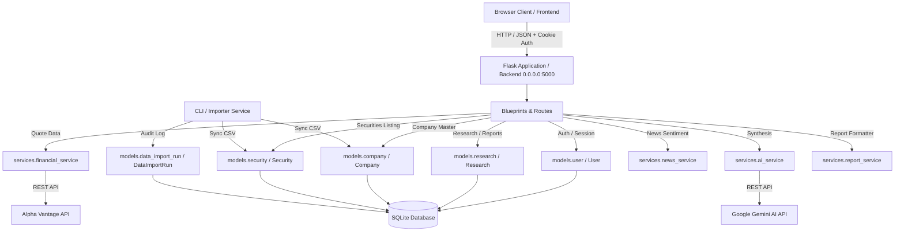

# InvestIQ Architecture & System Design

This document details the architectural structure, component responsibilities, database lifecycle, security model, and request flows of the InvestIQ Intelligence Platform.

---

## 1. System Overview

InvestIQ is a full-stack investment research platform combining live market data aggregation, financial analysis, and AI-powered report synthesis.

---

## 2. Frontend Layer

- **Technology**: Semantic HTML5, Vanilla CSS3 (custom responsive design system), Vanilla JavaScript (ES6+).
- **Communication**: Native Fetch API with `credentials: "include"` for session cookie transmission.
- **Race Condition Prevention**: Dynamic autocomplete search utilizes `AbortController` and an incremental request sequence ID to ensure slower responses do not overwrite newer suggestions.
- **State Handling**: Local session validation with `/api/auth/me` and `/api/auth/logout`.

---

## 3. Flask Backend Layer

- **Framework**: Flask 3.x with Flask-SQLAlchemy 3.x and Flask-CORS.
- **Application Factory Pattern**: `create_app(test_config=None)` in `backend/app.py`.
- **Server Binding**:
  - The Flask server binds to `0.0.0.0` on port `5000` (configurable via `PORT` environment variable).
  - It is accessible locally via `http://127.0.0.1:5000` or `http://localhost:5000`.
- **Configuration Precedence**:
  1. Base settings loaded from `backend/config.py` (`Config` class).
  2. Optional `test_config` dictionary applied before database initialization.
  3. Environment variables loaded via `dotenv.load_dotenv()`.

---

## 4. Database & Entity Architecture (Phase 1A)

### Entity Separation
1. **`Company`**: Represents the corporate entity/issuer (`id`, `legal_name`, `display_name`, `normalized_name`, `country`, `sector`, `industry`, `website`, `is_active`, timestamps).
2. **`Security`**: Represents the exchange-listed tradeable instrument (`id`, `company_id`, `symbol`, `exchange`, `series`, `isin`, `currency`, `asset_type`, `listing_date`, `paid_up_value`, `market_lot`, `face_value`, `is_active`, `source`, timestamps).
   - Relationship: One `Company` has many `Securities`.
   - Unique Constraint: `(exchange, symbol, series)` with non-null `series` (prevents SQL multi-NULL collision bypass).
3. **`DataImportRun`**: Audit trail storing batch execution statistics, SHA-256 hashes, and error summaries.

---

## 5. Master Importer Service Architecture

- **`csv_reader.py`**: Reads CSVs with BOM handling (`utf-8-sig`), strips header/cell whitespace, and computes cryptographic SHA-256 hashes.
- **`isin_validator.py`**: ISO 6166 12-character format and Luhn check-digit validation.
- **`normalizer.py`**: Space-preserving company name normalization (`"Tata Motors Limited"` -> `"tata motors limited"`), uppercase symbols, date/numeric parsing.
- **`nse_importer.py`**: Transactional import workflow:
  - Single outer transaction commits `Company`, `Security`, and `DataImportRun(status='completed')` atomically.
  - On fatal error, rolls back all entity changes and logs `DataImportRun(status='failed')` in a separate independent transaction.
  - Zero database writes in `--dry-run` mode.
  - Snapshot deactivation requires `--full-snapshot` and `--confirm-deactivation`, protected by configurable minimum row and percentage thresholds.

---

## 6. Routes & Endpoints

| Endpoint | Method | Blueprint / Handler | Purpose |
| :--- | :--- | :--- | :--- |
| `/api/health` | `GET` | `app.py` | Real-time health, DB status, and service configuration monitor |
| `/api/test` | `GET` | `app.py` | Connection verification endpoint |
| `/api/auth/signup` | `POST` | `auth_bp` | User registration with password hashing (`werkzeug.security`) |
| `/api/auth/login` | `POST` | `auth_bp` | User authentication and session cookie creation |
| `/api/auth/me` | `GET` | `auth_bp` | Returns profile of currently authenticated session user |
| `/api/auth/logout` | `POST` | `auth_bp` | Clears server session and expires cookie |
| `/api/companies/search` | `GET` | `companies_bp` | 5-tier ranked local company & security search (zero external calls) |
| `/api/research` | `POST` | `research_bp` | Creates a Research request record strictly with local `security_id` |
| `/api/research` | `GET` | `research_bp` | Lists research records for authenticated user |
| `/api/research/stats` | `GET` | `research_bp` | Real database metrics (total searches, distinct companies, total reports) |
| `/api/securities/<id>/market-data/latest` | `GET` | `securities_bp` | Latest verified EOD market data with safe decimal changes & freshness metadata |
| `/api/securities/<id>/market-data/summary` | `GET` | `securities_bp` | EOD market summary including 52-week High/Low and 1M/3M/6M/1Y period returns |
| `/api/securities/<id>/market-data/history` | `GET` | `securities_bp` | Chronological EOD price history (1m/3m/6m/1y/3y/5y/max or ISO date ranges, raw or adjusted) |
| `/api/research/<id>/financials` | `GET` | `research_bp` | Retrieves financial quote prioritizing verified local Bhavcopy data before external fallback |
| `/api/research/<id>/report` | `POST` | `research_bp` | Synthesizes investment report from saved analysis or retrieves existing report |

---

## 7. Market Data Service & Ingestion Architecture (Phase 2A & 2B)

### Dedicated Service Layer
- **`backend/services/market_data_service.py`**:
  - Implements `MarketDataService` handling security resolution, latest price calculation, previous-close fallback, division-by-zero protection, date range parsing, and database-level row limits.
  - Zero binary float conversion: exact decimal serialization (`Numeric(14, 4)` and `Numeric(20, 4)` mapped directly to standard strings).
  - Explicit freshness and adjustment metadata (`is_adjusted: false`, `data_type: "end_of_day"`).

### Multi-File Directory Ingestion
- **`backend/services/importer/nse_market_importer.py`**:
  - `import_bhavcopy_directory(...)` sorts Bhavcopy ZIP archives in deterministic alphabetical order.
  - Implements per-file independent transactions (success in one file is not rolled back if a subsequent file fails).
  - Skips already imported archives by inspecting `MarketDataImportRun.file_sha256` matching `status="completed"`.
  - Supports `--force` flag to deliberately re-process files idempotently.
  - Dry run validation writes 0 records to the database.

---

## 8. Corporate Actions & Historical Price Adjustment (Phase 2C)

### Corporate Actions Models & Importer
- **`CorporateAction`**: Stores parsed and raw exchange actions (`stock_split`, `bonus`, `cash_dividend`, `rights_issue`, etc.) with `ratio_from`, `ratio_to`, `cash_amount`, `ex_date`, and `processing_status` (`verified`, `applied`, `manual_review`).
- **`CorporateActionImportRun`**: Audit model recording ingestion runs, SHA-256 signatures, and review counts.
- **`CorporateActionParser`**: Standardizes purpose strings, validates ratios ($old > new > 0$ for splits, $B > 0, E > 0$ for bonuses), routes ambiguous wording to `manual_review`.

### Cumulative Adjustment Engine (`AdjustmentService`)
- **`AdjustedDailyPrice`**: Separate derived table referencing `daily_price_id` and `adjustment_version` (`split_bonus_v1`). Ground truth `daily_prices` is never overwritten.
- **Cumulative Multiplier Math**: Evaluates all verified actions with $t < \text{ex\_date}$ to compute exact cumulative price and volume multipliers.
- **`AdjustmentRun`**: Audits batch recalculations with per-security transaction isolation.
- **API & UI Integration**: `GET /api/securities/<id>/market-data/history?price_mode=split_adjusted` returns adjusted prices with explicit metadata (`applied_action_count`, `adjustment_version`, `disclaimer`).

