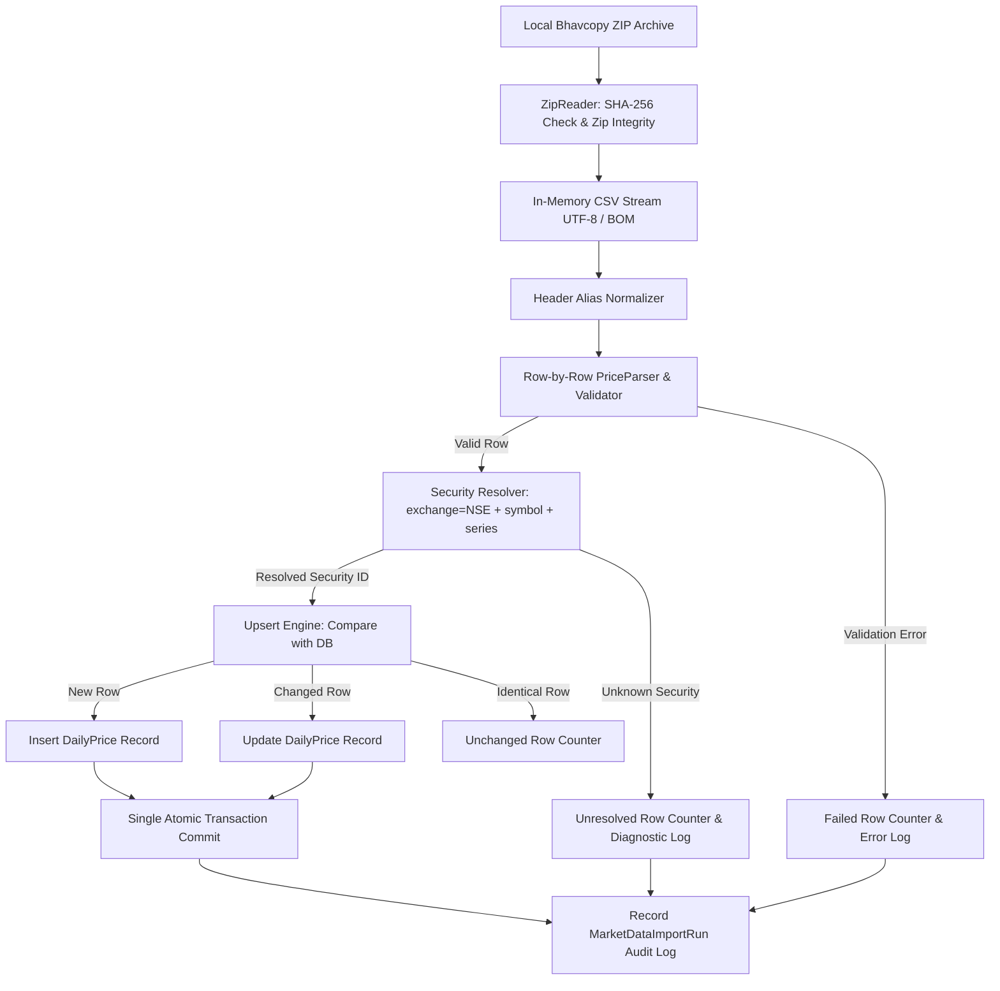
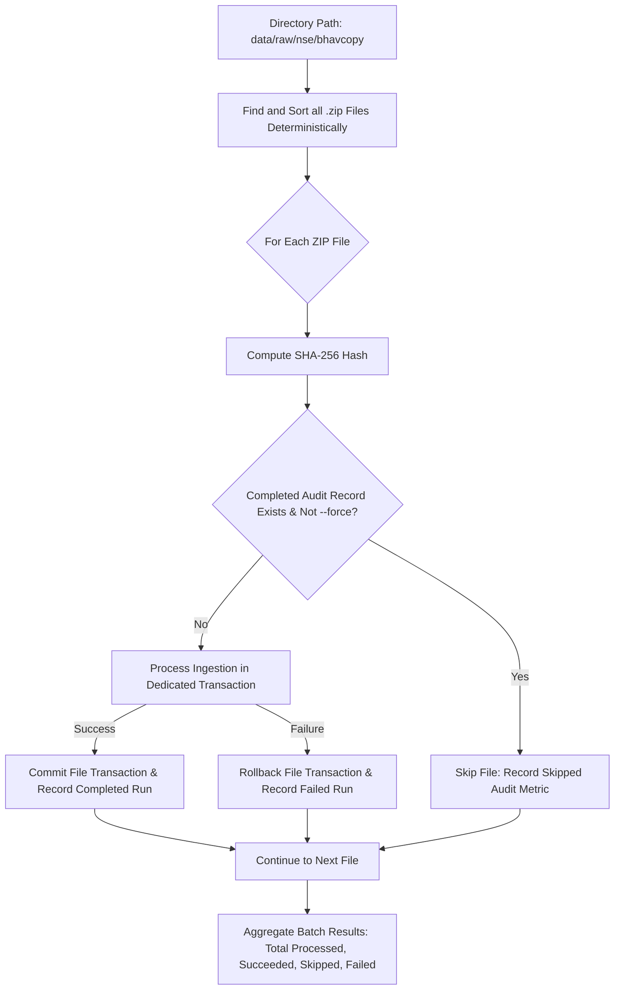

# InvestIQ Market Data Ingestion Pipeline (Phase 2A)

This document details the architecture, data structures, parsing logic, validation rules, and error recovery mechanisms of the End-of-Day (EOD) market data ETL pipeline.

---

## 1. Pipeline Architecture



---

## 2. Ingestion Stages & Responsibilities

### Stage 1: Archive Inspection & Security (`zip_reader.py`)
- **Path Traversal Protection:** Rejects any ZIP containing entries with `..`, absolute paths, or drive specifiers.
- **Single CSV Contract:** Ensures exactly one data CSV file exists in the archive; rejects ambiguous multi-file archives.
- **In-Memory Streaming:** Opens entries via `zipfile.ZipFile.open()` and `io.TextIOWrapper` with `utf-8-sig` encoding, avoiding extraction to disk.
- **Cryptographic Hashing:** Computes full SHA-256 before processing.

### Stage 2: Header Mapping & Row Parsing (`price_parser.py`)
- Standardizes both official UDiFF (`TradDt`, `TckrSymb`, `SctySrs`, `OpnPric`, `HghPric`, `LwPric`, `ClsPric`, `TtlTradgVol`, `TtlTrdVal`, `DlvryQty`, `DlvryPrcnt`) and legacy aliases.
- Converts all monetary prices to `decimal.Decimal` and volumes/trades to `int`.

### Stage 3: Domain Validation Rules
1. **Trading Date:** Mandatory, parsed across `YYYY-MM-DD`, `YYYYMMDD`, and `DD-MMM-YYYY`.
2. **Symbol & Series:** Mandatory uppercase strings.
3. **Non-Negativity:** Prices, turnover, volume, and trade counts must be $\ge 0$.
4. **OHLC Consistency:**
   $$\text{High} \ge \max(\text{Open}, \text{Low}, \text{Close}) \quad \text{and} \quad \text{Low} \le \min(\text{Open}, \text{High}, \text{Close})$$
5. **Delivery Percentage:** $0.0 \le \text{Delivery\%} \le 100.0$.
6. **Zero-Volume Handling:** Securities with 0 volume are stored without fabricating artificial trades.
7. **VWAP Computation:** Calculated as $\frac{\text{Turnover}}{\text{Volume}}$ when missing from raw feed.

### Stage 4: Resolution & Idempotent Upsert (`nse_market_importer.py`)
- Preloads all active `Security` entities into an in-memory dictionary `(symbol, series) -> security_id`.
- Reconciles rows against the unique key `(security_id, trading_date, source)`.
- Categorizes operations into `inserted_rows`, `updated_rows`, and `unchanged_rows`.

### Stage 5: Transaction & Audit Recovery
- **Atomicity:** All price inserts/updates for the batch are committed in a single transaction.
- **Rollback Guarantee:** Any fatal archive error, unhandled database exception, or strict mode violation triggers `db.session.rollback()`.
- **Independent Audit Logging:** Records a `MarketDataImportRun` row in a clean transaction *after* rollback to preserve operational visibility.

---

## 3. Directory Ingestion Workflow (`--directory`)



### Key Directory Ingestion Rules:
1. **Deterministic Order:** Sorts files alphabetically/chronologically to maintain predictable execution order.
2. **Per-File Transactions:** Each ZIP file runs inside its own isolated database transaction. Failure in a later file does NOT roll back prior successful files.
3. **Audit Hash Skipping:** A file is skipped without re-reading if a `MarketDataImportRun` with `status='completed'` and identical `file_sha256` already exists.
4. **Force Override (`--force`):** Bypasses hash skipping and forces re-evaluation and upsert of all rows.
5. **Dry-Run Mode (`--dry-run`):** Processes all archives in the directory without writing any records or audit logs.

---

## 4. CLI Ingestion Usage

```bash
# Dry-run validation of a single archive (no database writes)
python -m backend.cli.sync_market_data --source nse-udiff --file data/raw/nse/bhavcopy/BhavCopy_NSE_CM_0_0_0_20260915_F_0000.csv.zip --dry-run

# Live import of a single archive
python -m backend.cli.sync_market_data --source nse-udiff --file data/raw/nse/bhavcopy/BhavCopy_NSE_CM_0_0_0_20260915_F_0000.csv.zip

# Strict mode import (aborts and rolls back if any row is invalid or unresolved)
python -m backend.cli.sync_market_data --source nse-udiff --file data/raw/nse/bhavcopy/BhavCopy_NSE_CM_0_0_0_20260915_F_0000.csv.zip --strict

# Batch directory import (skips previously completed archives)
python -m backend.cli.sync_market_data --source nse-udiff --directory data/raw/nse/bhavcopy

# Batch directory import with forced reprocessing
python -m backend.cli.sync_market_data --source nse-udiff --directory data/raw/nse/bhavcopy --force
```
